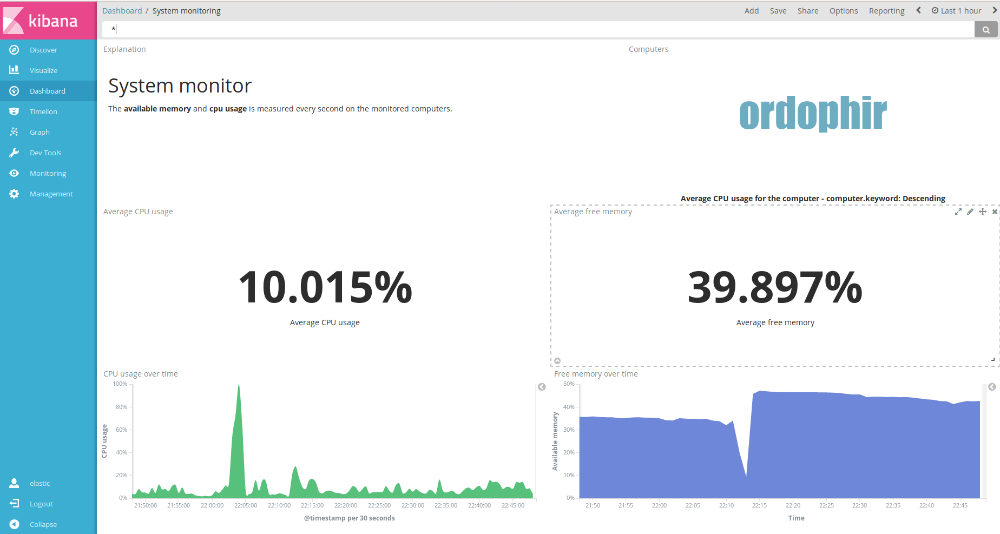
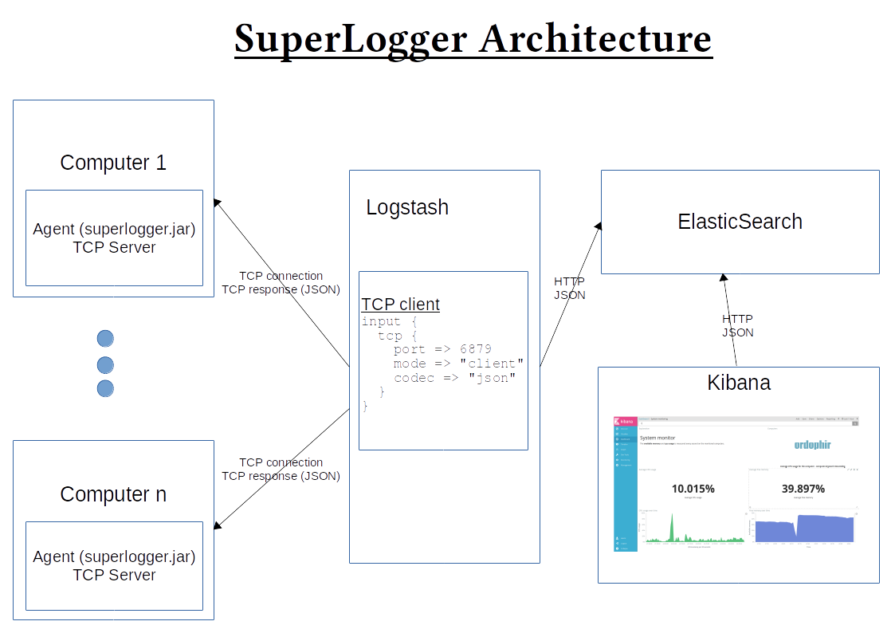
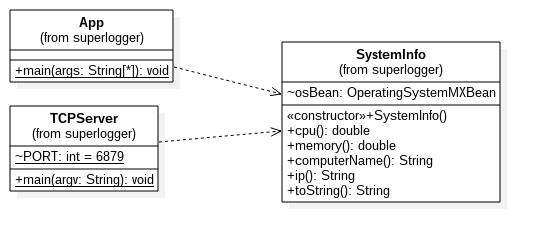

# SuperLogger
Log system information using logstash, store the information on ElasticSearch, and visualize it using Kibana.

## Explanation in russian
### Архитектура
#### Агент
Агент реализован на языке java. Он состоит из двух файла:
 - [`SystemInfo.java`](superlogger/src/main/java/SystemInfo.java) Простой класс который умеет собирать нужные данные.
 - [`TCPServer.java`](superlogger/src/main/java/TCPServer.java) очен простой сервер. При соединении клиента, он начинает отправлять ему
 каждую секунду имя ПК, IP-адрес, загрузку ЦП и загрузку ОЗУ, в формате JSON.

#### Посредник
Посредник - logstash. Он запускается контайнере docker, и читает свою конфигурацию в файле [`tcp2elastic.conf`](logstash/pipeline/tcp2elastic.conf).

При запуске, он соединяется с агентом и со сервером. Потом, каждую секунду, он получает данные от агента, добавляет в них `timestamp` и другие информации, и отправляет их на сервер.

#### Сервер хранения и обработки данных
Сервер - ElasticSearch. Он храняет данные, создает идексы, и отвечает на запросы интерфайса через протокол HTTP на формате JSON.

#### Интерфайс
Интерфайс - Kibana. В нём мы построили несколко полезных визуализации наших данных.

## Screenshot
#### The dashboard

## Architecture

## Class diagram

